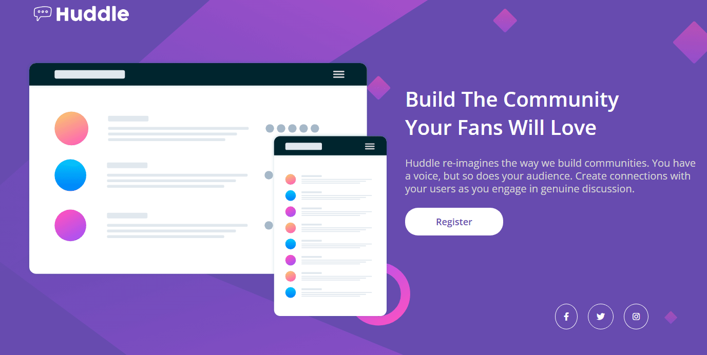
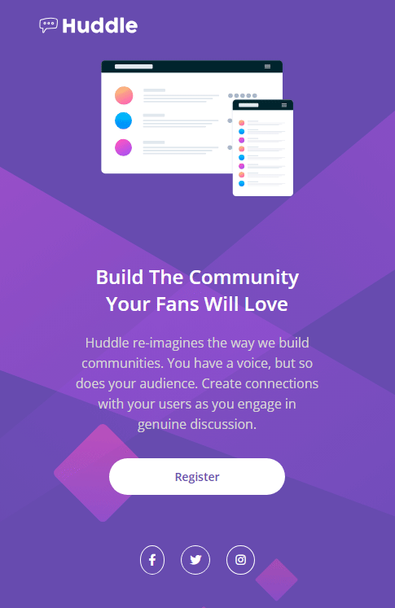

# Huddle - Comunidade 

Este projeto é uma página inicial responsiva para o Huddle, uma plataforma que visa criar comunidades para engajar seu público e promover discussões genuínas. A página foi desenvolvida utilizando HTML5 e CSS3 com foco em design moderno e intuitivo.

## Descrição

A página inicial do **Huddle** destaca-se pelo design limpo e amigável, com um esquema de cores roxo e ícones modernos. A interface é projetada para funcionar tanto em dispositivos desktop quanto em dispositivos móveis, sendo totalmente responsiva.

### Funcionalidades:
- **Layout Responsivo** Funciona tanto em dispositivos móveis quanto em desktops.
- **Chamado para ação** Um botão "Register" para incentivar os usuários a se cadastrarem.
- **Engajamento com redes sociais**: Ícones de redes sociais (Facebook, Twitter, Instagram) no rodapé para que os usuários possam conectar-se com a comunidade.
- **Design moderno**: Utilização de gradientes, ícones coloridos e uma estética atraente para melhorar a experiência do usuário.

## Tecnologias Utilizadas

- **HTML5**: Estrutura semântica da página.
- **CSS3**: Estilos personalizados para layout e design responsivo.

## Visão geral do projeto :
*Versão desktops* :

**Versão mobile** :
